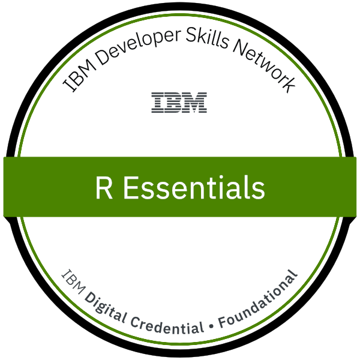

<h1 align="center">
   Hey, Nice to meet 😀  
</h1>

### A little more about me...

Graduated in Bachelor of Information Systems, in college I had contact with different technologies. Along the way, I took the Artificial Intelligence course, where I had my first contact with machine learning and Python. From this it became my passion to learn about this area. Today I work with machine learning and deep learning developing communication software. Along the way, I created a blog where I create some posts about subjects that I am studying and share them to help other users.

- 📖  I'm currently learning TensorFlow and Computer Vision
- ☕ Curiosity: I love coffee

### Follow Me

- [Kaggle](https://www.kaggle.com/sc0v1n0)
- [Codeberg](https://codeberg.org/sc0v0ne)
- [Mastodon](https://mastodon.social/@sc0v0ne)

### Development

### Badges

 
 
 

